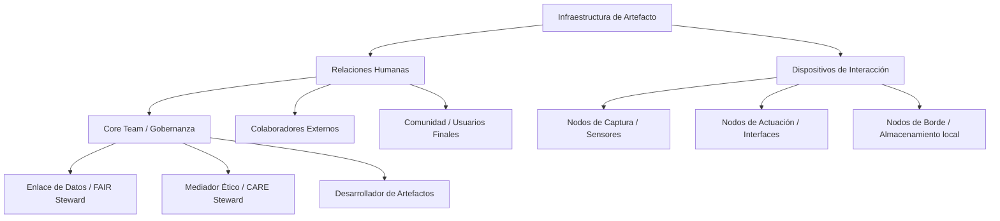

## 1. Declaración de Principios (FAIR / CARE)

Este proyecto adopta de manera nativa los principios **FAIR** (Findable, Accessible, Interoperable, Reusable) para la gestión de datos e infraestructuras, en simetría con los principios **CARE** (Collective Benefit, Authority to Control, Responsibility, Ethics) para el gobierno de datos humanos, grupales y comunitarios.

* **FAIR:** Infraestructura abierta, metadatos legibles por máquina y persistencia de artefactos.
* **CARE:** Retribución comunitaria, control de la interacción, responsabilidad en el sesgo de dispositivos y diseño ético.

## 2. Taxonomía de Árbol: Humanos y Dispositivos

La infraestructura del artefacto se entiende como una red simbiótica entre agentes humanos (roles, contribuciones al proyecto) y los dispositivos inorgánicos y agentes no-humanos (dispositivos de interacción, sensores, interfaces). 
Más clases se podrían armar para el caso quizá raro por el momento, en que intervengan plantas o animales domesticados como miembros decisores en un equipo.

## 3. Modelo de Contribución (Contributorship Matrix)

Inspirado en la lógica de `contributorship.qmd` de *interdomestic*, definimos los roles del Core Team no por jerarquía, sino por su tipo de interacción con el artefacto y la comunidad.

| Rol / Agente | Responsabilidad Principal | Principio Rector | Tipo de Interacción con el Dispositivo |
|---|---|---|---|
| **FAIR Steward** | Curaduría de datos, metadatos y apertura. | FAIR (Interoperable) | Gestión de APIs y Repositorios. |
| **CARE Steward** | Consentimiento local, soberanía de datos. | CARE (Ética) | Auditoría de interfaces y privacidad. |
| **Artefact Designer** | Desarrollo de hardware/software base. | FAIR (Reusable) | Programación de firmware y firmware OTA. |

## 4. Integración en el Plan de Gestión de Datos (PGD)

Esta taxonomía opera en la **Fase de Preparación** del ciclo de vida del proyecto científico-tecnológico. Asegura que:
1. Cada dispositivo tenga una persona humana responsable asignada.
2. Cada flujo de datos respete la procedencia e integridad (FAIR).
3. Los grupos o comunidades impactadas por los dispositivos "mantengan soberanía" sobre los datos capturados (CARE).

::: {.metadatos-final}
**Autor:**   
**Fecha de publicación:**   
**Última modificación:** 
:::
